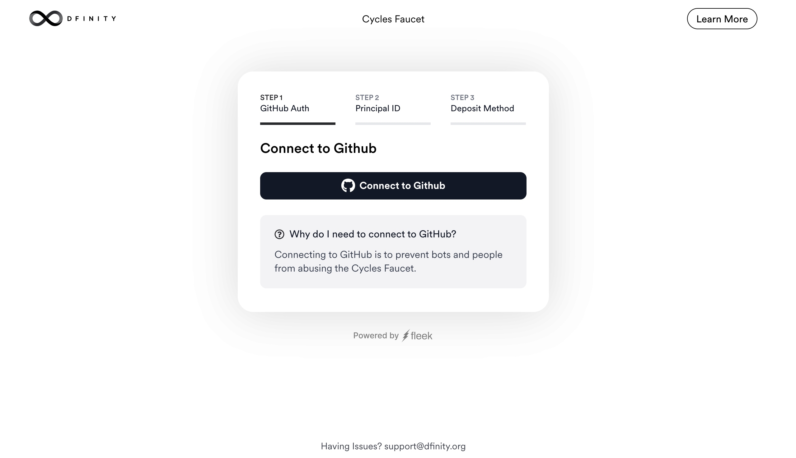
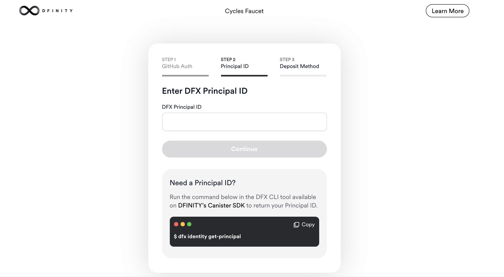
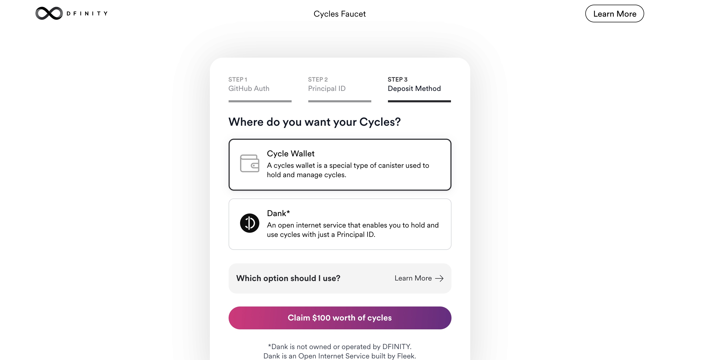
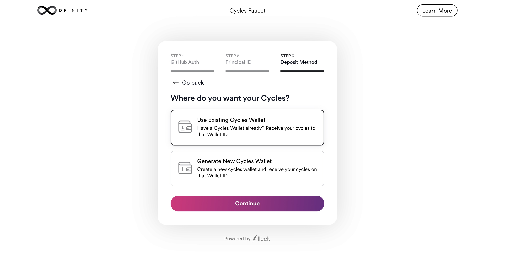
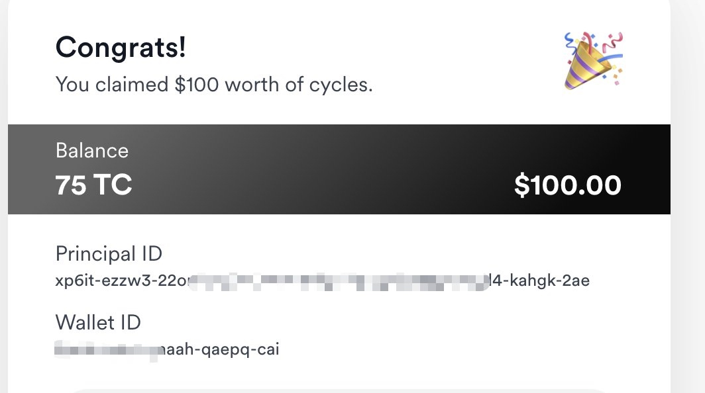

# 【ICP开发福利】Cycle水龙头：在互联网计算机上免费建造dApp

ICP水龙头快速获取Cycle步骤：

1.授权Github（账号90天前注册，需要最近30天是活跃的）

2.填写自己的Principal ID

3.选择接受Cycles，有已经存在的wallet或直接新建wallet

4.如果是已经存在的Cycle wallet，则输入xxx-cai的地址，然后下一步等待。

Cycles水龙头是开发人员可以立即开始利用的资源，以支持在互联网计算机上启动项目。

最近，通过对网络神经系统（NNS）的建议，网络上增加了应用子网的容量，所有的开发者都可以使用互联网计算机。为了帮助开发者在启动和运行时获得超强动力，DFINITY基金会与Fleek合作推出了一个Cycles水龙头。符合条件的开发者可以获得价值100美元的免费Cycles，开始在网络上部署Canister智能合约。

互联网计算机协议（ICP）代币是互联网计算机的本地实用代币。ICP代币可以在一个神经元内进行抵押，以参与网络治理，也可以转化为Cycles，在网络上运行软件。开发人员使用Cycles来支付互联网计算机上的计算和资源消耗。为了将Canisters部署到生产中，开发者首先需要获得ICP。由DFINITY基金会分配的ICP资助的Cycles水龙头，允许开发者跳过这一转换，只需几个简单的步骤就能部署Canisters。

+ 进入Cycles水龙头地址[https://faucet.dfinity.org/auth](https://faucet.dfinity.org/auth)后，开发者将能够选择两个选项之一来管理他们的Cycles（开发者将被提示输入他们的主标识符）：
    + Cycles钱包
    + Dank，这是Fleek提供的一项新服务。

Cycles钱包是一种特殊类型的Canister，用于管理Cycles的分配和所有权。在本地使用DFINITY Canister SDK时，一个Cycles钱包会作为默认dfx项目的一部分为你创建，使用Cycles钱包进行的大部分操作都会自动发生。为了在互联网计算机上将应用程序部署到生产中，开发人员需要首先创建一个Canister，并在其中部署一个新的cycle wallet。当在cycles faucet中选择这个选项时，这一切都会为你完成。提供的主标识符将被分配为新钱包Canister的控制器，使你能够使用你的Cycles余额部署Canisters。

根据设计，Cycles与开发者的主要标识符没有直接关联，因此需要一个Cycles钱包。这启发了Fleek创建Dank，这是一个在互联网计算机上运行的基于Canister的服务，使用户能够持有与他们的主标识符相关的Cycles余额。Dank在后台提供必要的Canister和Cycles管理基础设施，因此，开发者不需要部署自己的Cycles钱包。Dank甚至可以自动保持他们的Cycles余额充足。

Cycles水龙头是一种资源，开发者可以立即开始利用，以支持项目的启动。我们迫不及待地想看到不断增长的开发者社区开始在互联网计算机上建立什么!

原文：https://medium.com/dfinity/cycles-faucet-free-cycles-to-build-on-the-internet-computer-789166a95140

编译：kk德米安