# 【ICP登陆指南】通过Windows Hello登陆到Nns或添加新设备登陆的指南

目前可以支持超过 10 亿 Windows 用户通过 Internet Identity 轻松访问 dapps，为基于 IC 的 dapps 开辟了一个庞大增长用户群。

IC 社区已批准 NNS 提案 14835以升级Internet Identity身份认证，这是一种易于使用的加密区块链身份验证系统，使你可以安全且匿名地对 IC 上的 dapp 进行身份验证，以便它现在支持 Windows Hello — 允许 Windows 用户使用面部识别、指纹或虹膜扫描来验证自己的身份。

全球超过 10 亿人在使用 Windows 10系统，其中超过 85% 的人使用 Windows Hello，这是一个庞大的户群群体，现在可以轻松地使用基于IC dapp。

Internet Identity避免了困扰传统 Web 上的旧密码身份验证系统以及用于通过 Web 对区块链进行身份验证的现有系统的安全隐患。Internet Identity 允许你使用你的设备轻松地对区块链上的 dapp 进行身份验证，这种方式由 Internet 计算机的链密钥加密技术实现。

与 Internet 身份兼容的最终用户设备包括传统的安全密钥，例如 YubiKey，以及包含 TPM 芯片的移动设备，例如笔记本电脑或手机。已经有超过 100,000 人使用笔记本电脑上的指纹传感器或手机上的 FaceID 对完全在互联网计算机上运行的 dapp 进行身份验证。每个案例都提供了既方便又无缝的可用性。互联网身份正在不断完善，以使其与越来越多的设备兼容。

以下指南介绍了如何在手机上或使用安全密钥设置的现有身份增加Windows Hello 身份验证。下面分别在选项 A 和 B 中解释了设置。

**检查您的 Windows 设备是否支持 Windows Hello**

1.打开 Windows 设置，然后选择“帐户”。

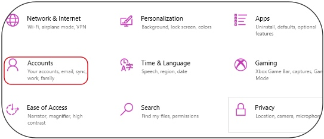

2.然后选择“登录选项”。
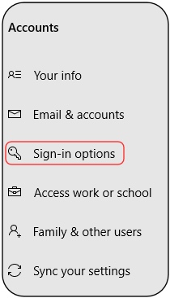

3.检查您的设备以确保它支持 Windows Hello 登录。

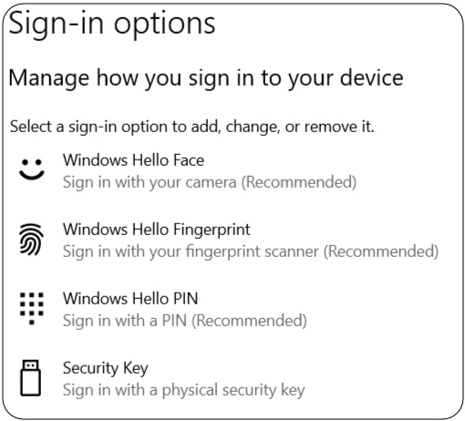

如果您的设备支持 Windows Hello，则可以继续。如果您使用手机设置了身份关联，请遵循选项 A，如果您使用了安全密钥，请遵循选项 B。

**选项 A：将 Windows Hello 添加到使用您的手机作为身份验证方法的身份定位点**

1.在您的 Windows 电脑上，访问 https://identity.ic0.app并单击“已经拥有的ID，使用新设备登陆？”

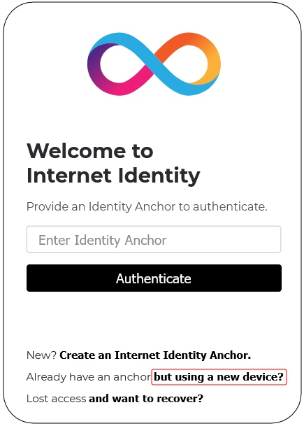

2.输入您已经注册的身份ID。

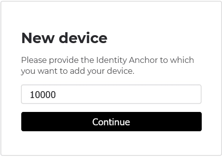

3.通过使用 Windows Hello 进行身份验证来完成 Windows Hello 对话框。
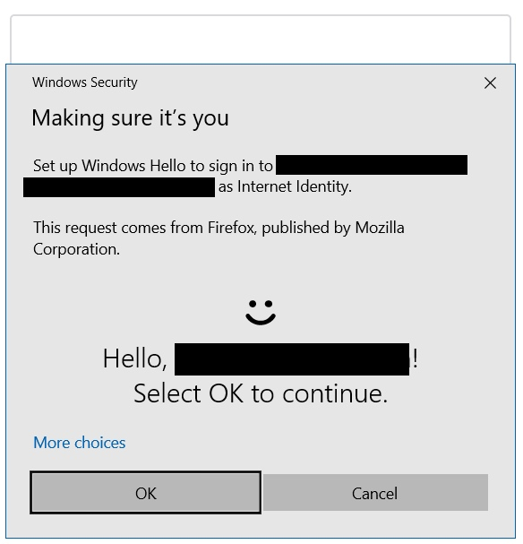

4.显示链接后，单击“显示为二维码”。
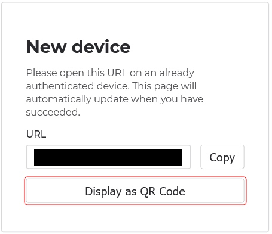

5.用手机扫描二维码授权登陆。
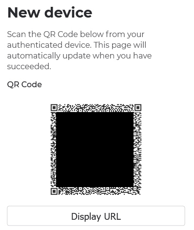

在手机上继续并按照步骤添加新的 Windows Hello 设备。在手机上完成这些步骤后，您应该能够使用 Windows Hello 在 Windows 设备上进行身份验证。

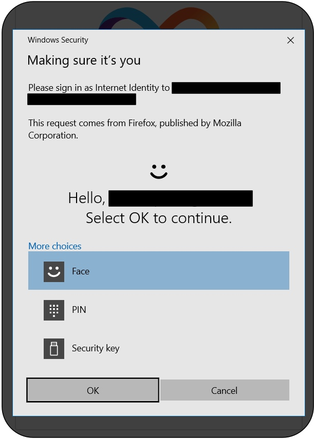

**选项 B：将 Windows Hello 添加到使用您的安全密钥作为身份验证方法的身份定位点**

1.在您的 Windows 计算机上，访问https://identity.ic0.app并使用您的安全密钥进行身份验证以访问 ID 管理页面。到达那里后，单击“+ 添加新设备”。

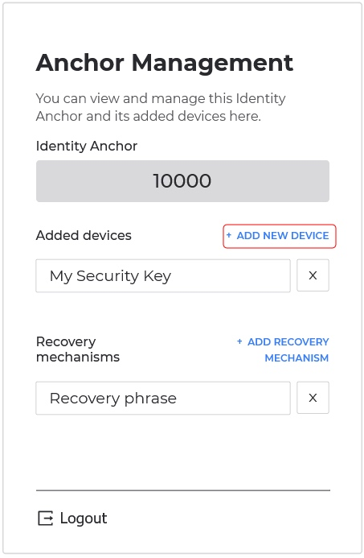

2.完成 Windows Hello 对话框。
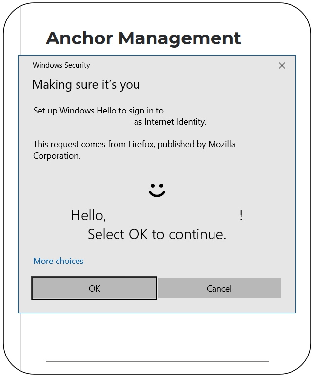

3.为您的 Windows 设备添加一个名称。
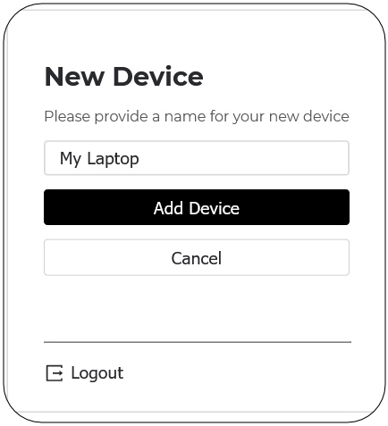

如果您刷新页面，你现在应该能够使用 Windows Hello 进行身份验证了。

原文：https://medium.com/dfinity/windows-hello-support-added-to-internet-identity-e9021f74afe9