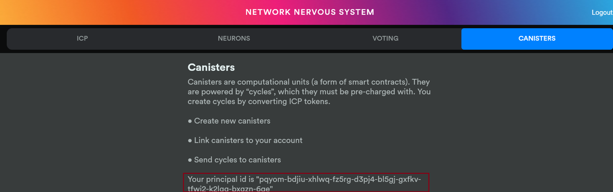
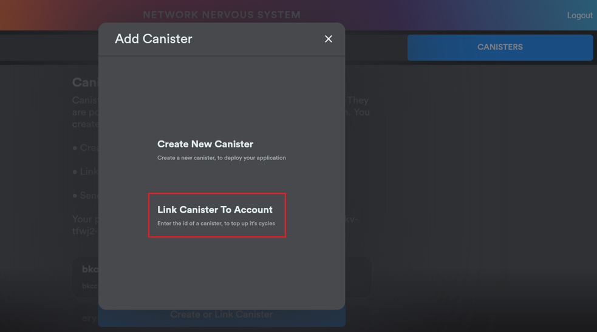
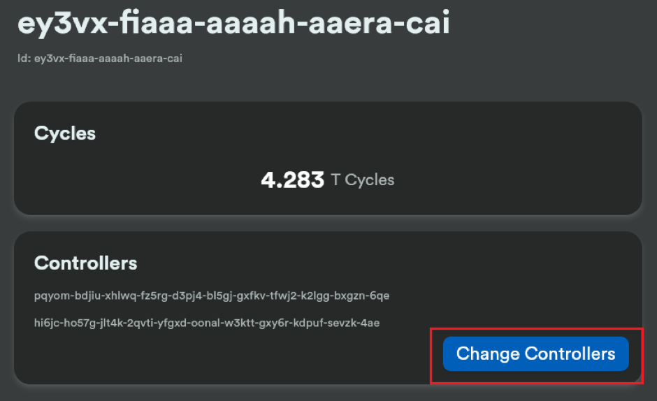

# Dfinity 开发最佳实践--账户迁移& 如何把传统的前端代码集成到Internet Identity 

### identity绑定wallet

identity进行canister创建需要wallet，并且发送消息至canister时也可以选择由wallet canister进行转发(dfx canister命令使用--no-wallet表明不使用wallet canister转发消息，而使用--wallet参数表明使用wallet canister转发消息)。

因此identity需要绑定wallet，绑定wallet有以下两种方式。

### 创建新的canister wallet并绑定

+ 创建新的`canister wallet`第一步需要创建一个新的空canister。有以下两种方式：
由`nns.ic0.app`创建一个空的canister，并将当前开发者的principal添加至该canister的控制列表，参见canister添加NNS账户控制的添加开发者身份至canister controller。
由命令`dfx ledger --network ic create-canister tsqwz-udeik-5migd-ehrev-pvoqv-szx2g-akh5s-fkyqc-zy6q7-snav6-uqe --amount 1.25`，不建议用第二种方式创建canister，还要将ICP转移至开发者账户才能进行，并且不易管理。

+ 执行以下命令将wallet wasm部署至创建的空的canister中并绑定到当前identity：
`dfx identity --network ic deploy-wallet gastn-uqaaa-aaaae-aaafq-cai`
其中`gastn-uqaaa-aaaae-aaafq-cai`替换为第一步创建除了的canister。

+ 执行以下命令将`canister wallet`授权调用给执行身份。
`dfx wallet --network ic authorize tsqwz-udeik-5migd-ehrev-pvoqv-szx2g-akh5s-fkyqc-zy6q7-snav6-uqe`，其中`tsqwz-udeik-5migd-ehrev-pvoqv-szx2g-akh5s-fkyqc-zy6q7-snav6-uqe` 替换为 `dfx identity get-principal`命令的输出。

### 绑定到已存在的canister wallet

+ 在原来存在wallet权限的身份下执行命令进行调用授权：
`dfx wallet --network ic authorize tsqwz-udeik-5migd-ehrev-pvoqv-szx2g-akh5s-fkyqc-zy6q7-snav6-uqe`
其中`tsqwz-udeik-5migd-ehrev-pvoqv-szx2g-akh5s-fkyqc-zy6q7-snav6-uqe`替换为新的授权。

+ 在新的身份下执行命令设置当前身份关联的wallet：
`dfx identity --network ic set-wallet --force gastn-uqaaa-aaaae-aaafq-cai`
其中`gastn-uqaaa-aaaae-aaafq-cai`为被关联的钱包。

### canister添加NNS账户控制

canister添加NNS账户控制有以下几个步骤：

获取`nns.ic0.app`账户的principal



本例中为：`pqyom-bdjiu-xhlwq-fz5rg-d3pj4-bl5gj-gxfkv-tfwj2-k2lgg-bxgzn-6qe`

### 移交canister控制权

执行以下命令将当前canister账户控制权交给NNS账户：

`dfx canister --network ic update-settings --controller pqyom-bdjiu-xhlwq-fz5rg-d3pj4-bl5gj-gxfkv-tfwj2-k2lgg-bxgzn-6qe canister_name`

其中：`pqyom-bdjiu-xhlwq-fz5rg-d3pj4-bl5gj-gxfkv-tfwj2-k2lgg-bxgzn-6qe`替换为你的NNS账户身份。

`canister_name`是你项目中的canister名称。

### 获取当前开发者身份

执行以下命令获取当前开发者身份：

`dfx identity --network ic get-principal`

`hi6jc-ho57g-jlt4k-2qvti-yfgxd-oonal-w3ktt-gxy6r-kdpuf-sevzk-4ae`


link canister至NNS ，将canister link至NNS




注意：如果link后界面显示没有控制权限(其实是有权限的)，可以发送2T个cycle来修复(可能是NNS内部状态不一致导致的)。

添加开发者身份至`canister controller`

将原来的开发者身份添加为canister的控制者。



### 集成Internet Identity 

Internet Identity(简称II)的集成需要区分为开发环境和主网环境，通过主网环境的II认证得到的principal是无法使用在开发环境的，通过开发环境的II认证的principal是无法使用在主网环境的。

### 开发环境

软件安装

集成开发环境的II需要下载安装以下软件：
dfx
Rust：通过命令 `"curl --proto '=https' --tlsv1.2 -sSf https://sh.rustup.rs | sh"` 进行安装。
NodeJS：通过命令 `"apt install nodejs; apt install npm; npm install -g n; n lts" `进行安装。
CMake：通过命令 `"apt install cmake" `进行安装。

### 部署本地II
通过执行以下命令来启动dfx开发链，并且在上面部署 `II canister：`
`git clone https://github.com/dfinity/internet-identity.git`
`cd internet-identity`
`npm install`
`dfx start --clean --background`
`II_ENV=development dfx deploy --no-wallet --argument '(null)'`
`dfx canister id internet_identity`

**注意：需要记下通过`"dfx canister id internet_identity"`获取到的II canister的II_Canister_ID。**

### 进行II认证

以下是进行II认证的代码示例：
```
import { AuthClient } from "@dfinity/auth-client";

let identityProvider = 'http://qwsdo-xaaaa-aaaah-aaa3a-cai.localhost:8000';
let identity;
try {
  const authClient = await AuthClient.create();
  if (await authClient.isAuthenticated()) {
    identity = authClient.getIdentity();
  } else {
    identity = await new Promise((resolve, reject) => {
      let timer = setTimeout(() => {
        timer = null;
        reject('do II auth timeout!');
      }, 30 * 1000);
      authClient.login({
        identityProvider,
        maxTimeToLive: BigInt(60_000_000_000),
        onSuccess: () => {
          if (timer != null) {
            clearTimeout(timer);
            timer = null;
            resolve(authClient.getIdentity());
          }
        },
        onError: (err) => {
          if (timer != null) {
            clearTimeout(timer);
            timer = null;
            reject(err);
          }
        },
      });
    });
  }
} catch (e) {
  console.log(e);
}
console.log(identity);
```
* identityProvider指定了II认证服务的url路径。如果未指定，那么默认为主网的identity.ic0.app。此处提供本地II路径。
* AuthClient.create()创建了auth client，并且如果已经做过Internet Identity，并且未过期，那么将会从local storage恢复identity。
* authClient.getIdentity()用于取出identity，该identity可能是经过II认证的，或者是匿名生成的。
* authClient.isAuthenticated()用于检验当前identity是否是经过II认证的。
* authClient.login(opt)用于打开一个新的窗口进行II认证。opt有以下选项：
* identityProvider提供认证服务的url路径，默认为identity.ic0.app。
* maxTimeToLive提供委托代理identity的有效时长，单位是ns。
* onSuccess指定成功认证的回调。
* onError指定失败认证的回调。

**注意：如果用户关闭的窗口而不进行认证，是不会产生onError回调的。**

+ 当II认证成功完成后，通过authClient.getIdentity()可以取得经过II认证的identity。

### 身份代理剩余时长

+ 通过以下方式可以获取经过II认证的identity的剩余有效时长：
```
const nextExpiration = identity.getDelegation().delegations
  .map(d => d.delegation.expiration)
  .reduce((current, next) => next < current ? next : current);
const expirationDuration  = nextExpiration - BigInt(Date.now()) * BigInt(1000_000);
```
### 身份代理请求
通过以下方式可以向canister发送请求：

```
import {Actor, HttpAgent} from "@dfinity/agent";

const agent = new HttpAgent({identity}); // identity是经过II认证的identity，如果为null，则默认为匿名identity。
await agent.fetchRootKey();
const idlFactory = ({ IDL }) =>
    IDL.Service({
       whoami: IDL.Func([], [IDL.Principal], ['query']),
    });
const canisterId = "qwsdo-xaaaa-aaaah-aaa3a-cai";
const actor = Actor.createActor(idlFactory, {agent, canisterId});
const principal = await actor.whoami();
```

* new HttpAgent({identity})生成代理请求的agent，该agent使用指定的identity作为请求的身份主体，如果未指定，则是匿名身份。
* agent.fetchRootKey()用于拉取rootkey，因为内置的rootkey是主网环境的。该代码只能开发环境中，在主网环境中一定不要使用。
* idlFactory定义了canister的接口。canisterId定义了canister的ID。
* Actor.createActor将创建actor。
* actor.whoami用于向canister发送请求。

### 主网环境

主网环境和开发环境主要的区别在于II认证和身份代理请求的区别。

+ 进行II认证

+ 以下是进行II认证的代码示例：

```
import { AuthClient } from "@dfinity/auth-client";

let identityProvider = null;
let identity;
try {
  const authClient = await AuthClient.create();
  if (await authClient.isAuthenticated()) {
    identity = authClient.getIdentity();
  } else {
    identity = await new Promise((resolve, reject) => {
      let timer = setTimeout(() => {
        timer = null;
        reject('do II auth timeout!');
      }, 30 * 1000);
      authClient.login({
        identityProvider,
        maxTimeToLive: BigInt(60_000_000_000),
        onSuccess: () => {
          if (timer != null) {
            clearTimeout(timer);
            timer = null;
            resolve(authClient.getIdentity());
          }
        },
        onError: (err) => {
          if (timer != null) {
            clearTimeout(timer);
            timer = null;
            reject(err);
          }
        },
      });
    });
  }
} catch (e) {
  console.log(e);
}
console.log(identity);
```

* identityProvider指定了II认证服务的url路径。如果未指定，那么默认为主网的identity.ic0.app。
* AuthClient.create()创建了auth client，并且如果已经做过Internet Identity，并且未过期，那么将会从local storage恢复identity。
* authClient.getIdentity()用于取出identity，该identity可能是经过II认证的，或者是匿名生成的。
* authClient.isAuthenticated()用于检验当前identity是否是经过II认证的。
* authClient.login(opt)用于打开一个新的窗口进行II认证。opt有以下选项：
* identityProvider提供认证服务的url路径，默认为identity.ic0.app。
* maxTimeToLive提供委托代理identity的有效时长，单位是ns。
* onSuccess指定成功认证的回调。
* onError指定失败认证的回调。

**注意：如果用户关闭的窗口而不进行认证，是不会产生onError回调的。**

+ 当II认证成功完成后，通过authClient.getIdentity()可以取得经过II认证的identity。

### 身份代理剩余时长
通过以下方式可以获取经过II认证的identity的剩余有效时长：

```
const nextExpiration = identity.getDelegation().delegations
  .map(d => d.delegation.expiration)
  .reduce((current, next) => next < current ? next : current);
const expirationDuration  = nextExpiration - BigInt(Date.now()) * BigInt(1000_000);
```

### 身份代理请求

通过以下方式可以向canister发送请求：

```
import {Actor, HttpAgent} from "@dfinity/agent";

const agent = new HttpAgent({identity}); // identity是经过II认证的identity，如果为null，则默认为匿名identity。
// await agent.fetchRootKey(); // 主网环境不能拉取rootkey，否则可能导致中间人攻击。
const idlFactory = ({ IDL }) =>
    IDL.Service({
       whoami: IDL.Func([], [IDL.Principal], ['query']),
    });
const canisterId = "qwsdo-xaaaa-aaaah-aaa3a-cai";
const actor = Actor.createActor(idlFactory, {agent, canisterId});
const principal = await actor.whoami();
```

* new HttpAgent({identity})生成代理请求的agent，该agent使用指定的identity作为请求的身份主体，如果未指定，则是匿名身份。
* idlFactory定义了canister的接口。canisterId定义了canister的ID。
* Actor.createActor将创建actor。
* actor.whoami用于向canister发送请求。

### 通过Candid请求Canister

向canister发送请求有两种情况：本项目的canister以及其他项目的canister。

+ 本项目的Canister
    + 对于引用本项目的Canister，步骤如下：
        - 在dfx.json中添加依赖。
        - 导入canister的IDL定义以及canister ID。
        - 创建Actor。
        - 发送请求。

+ 添加依赖

+ 在dfx.json中添加依赖，例如：

```
{
  "canisters": {
    "game2048": {
      "main": "src/game2048/main.mo",
      "type": "motoko"
    },
    "game2048_assets": {
      "dependencies": [
        "game2048"
      ],
      "frontend": {
        "entrypoint": "src/game2048_assets/src/index.html"
      },
      "source": [
        "src/game2048_assets/assets",
        "dist/game2048_assets/"
      ],
      "type": "assets"
    }
  },
  ...
}

```

### 导入IDL和ID

然后导入canister的IDL定义以及canister ID。例如：

```
import {idlFactory as customGame2048IDL, canisterId as customGame2048ID} from "dfx-generated/game2048";
```

+ 其中game2048是canister的名称。

+ 具体的canister的IDL定义和canister ID可以在<project_root>/.dfx/local/canisters/<canister_name>/<canister_name>.js中找到。

### 创建Actor

当拥有canister的IDL定义和canister ID后就可以创建Actor。例如：

`const game2048Actor = Actor.createActor(customGame2048IDL, {agent, canisterId: customGame2048ID});`

其中agent为请求代理，具体可以查看身份代理请求。

### 发送请求

当成功创建actor后就可以像canister发送请求。例如：

`let userInfo = await game2048Actor.userInfo()`

### 其他项目的Canister

向其他项目的canister发送请求与本项目的区别在于，不需要添加依赖，但是需要手动指定canister的IDL定义和ID。

### 指定IDL和ID

先指定canister的IDL定义以及canister ID。例如：

```
const canisterId = Principal.fromText(canisterIdEl.value);
const idlFactory = ({ IDL }) =>
    IDL.Service({
      whoami: IDL.Func([], [IDL.Principal], ['query']),
    });
```

### 创建Actor

当拥有canister的IDL定义和canister ID后就可以创建Actor。例如：

`const whoamiActor = Actor.createActor(idlFactory, {agent, canisterId});`

其中agent为请求代理，具体可以查看身份代理请求。

### 发送请求
当成功创建actor后就可以像canister发送请求。例如：

`let principal = await actor.whoami()`

### IDL定义
IDL定义是一个服务声明生成函数。例如：

```
({ IDL }) =>
    IDL.Service({
      whoami: IDL.Func([], [IDL.Principal], ['query']),
register : IDL.Func([IDL.Text, IDL.Text],[IDL.Bool, IDL.Bool, IDL.Nat],[],),
    });
```

* 函数的入参为IDL。
* IDL.Service函数用于生成服务声明。其接受一个对象参数，对象的字段名称为actor的函数名称，对象的字段值为actor的函数签名。
* IDL.Func函数用于生成函数签名：
* 第一个参数为入参数组，数组的每个元素指示入参的类型。
* 第二个参数为返回值数组，长度为0表示没有返值，数组的每个元素代表tuple每个值的类型。
* 第三个参数为函数类型数组。[]表示shared类型函数，['query']表示shared query类型函数。

### 类型映射

+ Text：字符串。例如"123"。
+ Principal：Princiapl。导入方式import { Principal } from "@dfinity/agent";
+ Blob：数值数组。例如[1,2,3]。
+ Nat：BigNumber。导入方式import {BigNumber} from "bignumber.js";
+ Int：BigNumber。导入方式import {BigNumber} from "bignumber.js";
+ NatN：Nat8、Nat16、Nat32对应为数值，Nat64对应BigNumber。
+ IntN：Int8、Int16、Int32对应为数值，Int64对应BigNumber。
+ Float：数值。例如1.235。
+ Bool：布尔值。例如true或false。
+ Null：null。
+ [T]：数组。例如["1", "2"]。
+ ?T：数组。null对应空数组[]，否则为单元素数组。
+ Tuple：数组。例如["1",1]。
+ Record：对象。例如{"a":1,"b":"2"}。
+ Variant：对象。仅有单个键值对的对象。例如{"tag":"value"}。
+ Func：[Princiapl, 字符串]。Func类型代表一个Service的函数引用。数组第一个为该service的身份，第二个元素为函数名称。
+ Service：Princiapl。为该service的身份。
+ Any：任意类型。
+ None：没有值，不会返回。

作者 : machenjie

Github地址:[machenjie](https://github.com/machenjie/dfinity-study)

